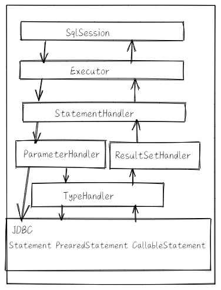

### Mybatis工具类

org.apache.ibatis.jdbc.SQL  通过方法拼接参数，方法名对应都是Sql关键字

org.apache.ibatis.jdbc.ScriptRunner 执行Sql script工具

org.apache.ibatis.jdbc.SqlRunner 执行Sql 语句工具

```java
 public int insert(String sql, Object... args) throws SQLException
 public int update(String sql, Object... args) throws SQLException
 public int delete(String sql, Object... args) throws SQLException
 public Map<String, Object> selectOne(String sql, Object... args) throws SQLException 
 public List<Map<String, Object>> selectAll(String sql, Object... args) throws SQLException
```

org.apache.ibatis.reflection.MetaObject 利用反射获取或设置对象属性值

org.apache.ibatis.reflection.MetaClass 利用反射获取类的信息（比如 getGetInvoker，setSetInvoker是 get set方法 ）

org.apache.ibatis.reflection.DefaultReflectorFactory 默认反射工场类

org.apache.ibatis.reflection.Reflector 反射器通过ReflectorFactory创建

org.apache.ibatis.reflection.factory.ObjectFactory 对象工厂，mybatis每次创建mapper映射结果对象的新实例时，都会使用这个对象完成，默认实现类org.apache.ibatis.reflection.factory.DefaultObjectFactory 

```java
DefaultObjectFactory factory = new DefaultObjectFactory();
List<Integer> list = factory.create(List.class);
```

org.apache.ibatis.executor.loader.ProxyFactory 动态代理对象，分别有两个不同实现cglib和javassist

> MetaObject，MetaClass 用于对类和对象的操作；ObjectFactory，ProxyFactory 用于对象创建，ObjectFactory创建Mapper映射的实体对象，ProxyFactory 用于创建Mapper映射实体对象的动态代理对象

### 核心组件



##### Configuration

用于配置Mybatis主配置信息，比如Mapper，类型别名，TypeHandler等；该类的属性跟xml里的标签对应，还作为Executor、StatementHandler、ResultSetHandler、ParameterHandler组件的工厂类

配置类重要属性：

```java
//mapper
protected final MapperRegistry mapperRegistry = new MapperRegistry(this);

//interceptor
protected final InterceptorChain interceptorChain = new InterceptorChain();

//typeHandler
protected final TypeHandlerRegistry typeHandlerRegistry = new TypeHandlerRegistry();

//别名
protected final TypeAliasRegistry typeAliasRegistry = new TypeAliasRegistry();

//LanguageDriver用于解析SQL配置，将配置转换成SqlSource对象
protected final LanguageDriverRegistry languageRegistry = new LanguageDriverRegistry();

//MappedStatement对象描述<insert|select|update|delete>等标签或者通过@Select、@Delete、@Update、@Insert等注解配置的SQL信息，Key为Mapper的Id+方法id
//final String mappedStatementId = type.getName() + "." + method.getName();
//org.apache.ibatis.builder.MapperBuilderAssistant#applyCurrentNamespace
 protected final Map<String, MappedStatement> mappedStatements = new StrictMap<MappedStatement>("Mapped Statements collection");

//用于注册Mapper配置文件中通过<resultMap>标签配置的ResultMap信息，Key由Mapper命名空间和<resultMap>标签的id属性构成
 protected final Map<String, ResultMap> resultMaps = new StrictMap<ResultMap>("Result Maps collection");

//用于注册Mapper中通过<parameterMap>标签注册的参数映射信息。Key由Mapper命名空间和<parameterMap>标签的id属性构成
  protected final Map<String, ParameterMap> parameterMaps = new StrictMap<ParameterMap>("Parameter Maps collection");
  protected final Map<String, KeyGenerator> keyGenerators = new StrictMap<KeyGenerator>("Key Generators collection");
```

##### MappedStatement

描述Mapper种SQL配置信息，对XML配置文件种<select|update|delete|insert>等标签或@select等注解配置信息的封装，对应的属性都跟xml匹配。

##### Executor

sql执行器，分别三种：

SimpleExecutor：基础的只能够完成增删改查操作

ResueExecutor：ResueExecutor对JDBC中的Statement对象做了缓存，当执行相同的SQL语句时，直接从缓存中取出Statement对象进行复用，避免了频繁创建和销毁Statement对象，从而提升系统性能，这是享元思想的应用

`org.apache.ibatis.executor.ReuseExecutor#prepareStatement`

BatchExecutor：会对调用同一个Mapper执行的update、insert和delete操作，调用Statement对象的批量操作功能

CachingExecutor：为查询操作增加二级缓存功能

##### SqlSession

面向用户api，表示和数据库交互时的会话对象，用于完成数据库的增删改查；sqlsession是executor组件的外观，目的为用户提供友好的api

##### StatementHandler

封装对jdbc statement对象的操；SimpleStatementHandler继承至BaseStatementHandler，封装了对JDBC Statement对象的操作，PreparedStatementHandler封装了对JDBC PreparedStatement对象的操作，而CallableStatementHandler则封装了对JDBC CallableStatement对象的操作。

##### ParamenterHandler

封装对jdbc parament对象的操，如果SQL语句中有参数占位符，在执行SQL语句之前，就需要为参数占位符设置。默认实现DefaultParameterHandler，观察setParameters方法

##### ResultSetHandler

封装对jdbc resultset对象的操作，用于在StatementHandler对象执行完查询操作或存储过程后，对结果集或存储过程的执行结果进行处理

##### TypeHandler

类型处理，用于处理Java类型与jdbc类型之间的映射

- PreparedStatement对象为参数占位符设置值时，需要调用PreparedStatement接口中提供的一系列的setXXX()方法，将Java类型转换为对应的JDBC类型并为参数占位符赋值。
- 执行SQL语句获取ResultSet对象后，需要调用ResultSet对象的getXXX()方法获取字段值，此时会将JDBC类型转换为Java类型。

